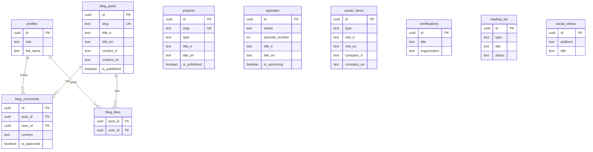

# Supabase Architecture Plan — Portfolio Obsidian

## Overview

Migrate all mock/dictionary data to Supabase, add authentication (GitHub + Google), multi-role users (Admin, User, Client), and interactive features (blog comments & likes).

---

## 1. Authentication & Users

### Auth Providers

- **GitHub** and **Google** via Supabase Auth
- Users register through blog interaction or explicit sign-up

### Roles

| Role     | Description         | Access                                       |
| -------- | ------------------- | -------------------------------------------- |
| `admin`  | Poyraz (site owner) | Full CRUD on all tables, comment moderation  |
| `user`   | Blog visitors       | Comment, like blog posts (after login)       |
| `client` | Paying clients      | Access to Client Portal (invoices, projects) |

### Tables

#### `profiles`

Extends Supabase `auth.users` with app-specific fields.

```sql
CREATE TABLE profiles (
  id          UUID PRIMARY KEY REFERENCES auth.users(id) ON DELETE CASCADE,
  full_name   TEXT,
  avatar_url  TEXT,
  role        TEXT NOT NULL DEFAULT 'user' CHECK (role IN ('admin', 'user', 'client')),
  created_at  TIMESTAMPTZ DEFAULT now(),
  updated_at  TIMESTAMPTZ DEFAULT now()
);
```

> [!IMPORTANT]
> A database trigger should auto-create a `profiles` row on `auth.users` INSERT with `role = 'user'`. Admin and client roles are assigned manually via Supabase dashboard or admin API.

---

## 2. Database Schema

### i18n Strategy

Dynamic data that needs translation (projects, blog posts, etc.) will use a **JSONB locale column** pattern:

```
title_tr TEXT, title_en TEXT
description_tr TEXT, description_en TEXT
```

This is simpler than a separate translations table and works well for a 2-locale system. The frontend fetches the column matching the current locale.

---

### 2.1 Projects & Products

Single `projects` table covering all showcase and product types.

```sql
CREATE TABLE projects (
  id              UUID PRIMARY KEY DEFAULT gen_random_uuid(),
  slug            TEXT UNIQUE NOT NULL,

  -- Type discriminator
  type            TEXT NOT NULL CHECK (type IN (
    'portfolio', 'fullstack_case', 'design_case', 'open_source',
    'product_saas', 'product_mobile', 'product_figma'
  )),

  -- Core fields (i18n)
  title_tr        TEXT NOT NULL,
  title_en        TEXT NOT NULL,
  description_tr  TEXT,
  description_en  TEXT,
  category_tr     TEXT,
  category_en     TEXT,

  -- Detail fields (i18n)
  problem_tr      TEXT,
  problem_en      TEXT,
  solution_tr     TEXT,
  solution_en     TEXT,
  role_tr         TEXT,
  role_en         TEXT,
  design_process_tr   TEXT,
  design_process_en   TEXT,
  technical_details_tr TEXT,
  technical_details_en TEXT,
  lessons_learned_tr   TEXT,
  lessons_learned_en   TEXT,

  -- Structured data
  features        JSONB DEFAULT '[]',        -- ["Feature 1", "Feature 2"]
  tags            TEXT[] DEFAULT '{}',
  gallery_images  TEXT[] DEFAULT '{}',
  cover_image     TEXT,
  year            TEXT,

  -- Links
  demo_url        TEXT,
  repo_url        TEXT,
  case_study_url  TEXT,

  -- Open source specific
  npm_package     TEXT,                      -- npm package name
  stars           INT,
  forks           INT,
  language        TEXT,

  -- Product specific
  is_premium      BOOLEAN DEFAULT false,
  price           DECIMAL(10,2),

  -- Figma specific
  figma_url       TEXT,
  screens_count   INT,
  components_count INT,

  -- Sorting & visibility
  sort_order      INT DEFAULT 0,
  is_published    BOOLEAN DEFAULT true,
  featured        BOOLEAN DEFAULT false,

  created_at      TIMESTAMPTZ DEFAULT now(),
  updated_at      TIMESTAMPTZ DEFAULT now()
);
```

---

### 2.2 Blog

```sql
CREATE TABLE blog_posts (
  id              UUID PRIMARY KEY DEFAULT gen_random_uuid(),
  slug            TEXT UNIQUE NOT NULL,

  title_tr        TEXT NOT NULL,
  title_en        TEXT NOT NULL,
  excerpt_tr      TEXT,
  excerpt_en      TEXT,
  content_tr      TEXT,          -- Markdown
  content_en      TEXT,          -- Markdown
  category        TEXT,          -- tech, design, engineering
  cover_image     TEXT,
  read_time_min   INT,
  tags            TEXT[] DEFAULT '{}',

  is_published    BOOLEAN DEFAULT false,
  published_at    TIMESTAMPTZ,
  created_at      TIMESTAMPTZ DEFAULT now(),
  updated_at      TIMESTAMPTZ DEFAULT now()
);

CREATE TABLE blog_comments (
  id              UUID PRIMARY KEY DEFAULT gen_random_uuid(),
  post_id         UUID NOT NULL REFERENCES blog_posts(id) ON DELETE CASCADE,
  user_id         UUID NOT NULL REFERENCES profiles(id) ON DELETE CASCADE,
  content         TEXT NOT NULL,
  is_approved     BOOLEAN DEFAULT false,   -- Admin must approve
  created_at      TIMESTAMPTZ DEFAULT now()
);

CREATE TABLE blog_likes (
  post_id         UUID NOT NULL REFERENCES blog_posts(id) ON DELETE CASCADE,
  user_id         UUID NOT NULL REFERENCES profiles(id) ON DELETE CASCADE,
  created_at      TIMESTAMPTZ DEFAULT now(),
  PRIMARY KEY (post_id, user_id)            -- One like per user per post
);
```

> [!NOTE]
> Comments require `is_approved = true` to be visible. Admin approves via dashboard or admin panel.

---

### 2.3 Media — Masa Başı & Yazılıma Dair

```sql
CREATE TABLE episodes (
  id              UUID PRIMARY KEY DEFAULT gen_random_uuid(),
  series          TEXT NOT NULL CHECK (series IN ('masa_basi', 'yazilima_dair')),
  episode_number  INT NOT NULL,
  season          INT DEFAULT 1,

  title_tr        TEXT NOT NULL,
  title_en        TEXT NOT NULL,
  description_tr  TEXT,
  description_en  TEXT,

  guest_name      TEXT,
  guest_role      TEXT,
  guest_image     TEXT,

  date            DATE NOT NULL,
  duration        TEXT,                      -- "1h 15m"
  topics          TEXT[] DEFAULT '{}',

  youtube_url     TEXT,
  spotify_url     TEXT,

  -- Masa Başı "upcoming" special field
  is_upcoming     BOOLEAN DEFAULT false,

  is_published    BOOLEAN DEFAULT true,
  created_at      TIMESTAMPTZ DEFAULT now(),
  updated_at      TIMESTAMPTZ DEFAULT now(),

  UNIQUE (series, episode_number, season)
);
```

---

### 2.4 Social Hub

```sql
CREATE TABLE social_videos (
  id              UUID PRIMARY KEY DEFAULT gen_random_uuid(),
  platform        TEXT NOT NULL CHECK (platform IN ('youtube', 'instagram', 'tiktok')),

  title           TEXT,
  external_id     TEXT,                      -- YouTube video ID, Instagram post ID
  thumbnail_url   TEXT,
  video_url       TEXT,

  likes_count     TEXT,                      -- "1.2K" format
  comments_count  TEXT,

  sort_order      INT DEFAULT 0,
  is_published    BOOLEAN DEFAULT true,
  created_at      TIMESTAMPTZ DEFAULT now()
);
```

---

### 2.5 Career & Education

```sql
CREATE TABLE career_items (
  id              UUID PRIMARY KEY DEFAULT gen_random_uuid(),
  type            TEXT NOT NULL CHECK (type IN ('work', 'volunteer', 'education')),

  role_tr         TEXT NOT NULL,
  role_en         TEXT NOT NULL,
  company_tr      TEXT NOT NULL,
  company_en      TEXT NOT NULL,
  date_tr         TEXT NOT NULL,             -- "Jul 2025 - Present"
  date_en         TEXT NOT NULL,
  location        TEXT,
  employment_type TEXT,                      -- Part-time, Internship, Volunteer, Club

  description_tr  JSONB DEFAULT '[]',        -- ["Bullet 1", "Bullet 2"]
  description_en  JSONB DEFAULT '[]',
  skills          TEXT[] DEFAULT '{}',

  sort_order      INT DEFAULT 0,
  is_published    BOOLEAN DEFAULT true,
  created_at      TIMESTAMPTZ DEFAULT now(),
  updated_at      TIMESTAMPTZ DEFAULT now()
);
```

---

### 2.6 Certifications

```sql
CREATE TABLE certifications (
  id              UUID PRIMARY KEY DEFAULT gen_random_uuid(),

  title           TEXT NOT NULL,             -- Usually not translated
  organization    TEXT NOT NULL,
  issue_date_tr   TEXT,
  issue_date_en   TEXT,
  credential_url  TEXT,
  tags            TEXT[] DEFAULT '{}',

  sort_order      INT DEFAULT 0,
  is_published    BOOLEAN DEFAULT true,
  created_at      TIMESTAMPTZ DEFAULT now()
);
```

---

### 2.7 Reading & Watch List

```sql
CREATE TABLE reading_list (
  id              UUID PRIMARY KEY DEFAULT gen_random_uuid(),
  type            TEXT NOT NULL CHECK (type IN ('book', 'video')),

  title           TEXT NOT NULL,
  author          TEXT NOT NULL,
  category        TEXT,                      -- Software Engineering, Career, Architecture
  platform        TEXT,                      -- YouTube, Udemy (for videos only)
  cover_image     TEXT,
  external_url    TEXT,                      -- Amazon link, YouTube link

  status          TEXT DEFAULT 'queue' CHECK (status IN (
    'read', 'reading', 'queue', 'watched', 'watching'
  )),

  sort_order      INT DEFAULT 0,
  is_published    BOOLEAN DEFAULT true,
  created_at      TIMESTAMPTZ DEFAULT now()
);
```

---

## 3. Row Level Security (RLS) Policies

All tables will have RLS enabled. The pattern:

| Operation                        | Admin | User | Client | Anonymous |
| -------------------------------- | ----- | ---- | ------ | --------- |
| **SELECT** published data        | ✅    | ✅   | ✅     | ✅        |
| **SELECT** unpublished           | ✅    | ❌   | ❌     | ❌        |
| **INSERT/UPDATE/DELETE** content | ✅    | ❌   | ❌     | ❌        |
| **INSERT** blog comments         | ✅    | ✅   | ✅     | ❌        |
| **INSERT/DELETE** blog likes     | ✅    | ✅   | ✅     | ❌        |
| **UPDATE** comment approval      | ✅    | ❌   | ❌     | ❌        |

Example RLS policy for `projects`:

```sql
-- Public read for published items
CREATE POLICY "Public read" ON projects
  FOR SELECT USING (is_published = true);

-- Admin full access
CREATE POLICY "Admin full access" ON projects
  FOR ALL USING (
    EXISTS (SELECT 1 FROM profiles WHERE id = auth.uid() AND role = 'admin')
  );
```

---

## 4. ER Diagram



---

## 5. Frontend Integration Strategy

### Data Fetching Pattern

```
lib/
  supabase/
    client.ts            -- Browser client (createBrowserClient)
    server.ts            -- Server client (createServerClient)
    queries/
      projects.ts        -- getProjects(), getProjectBySlug()
      blog.ts            -- getPosts(), getPostBySlug(), getComments()
      episodes.ts        -- getEpisodes(), getUpcomingEpisode()
      career.ts          -- getCareerItems()
      certifications.ts  -- getCertifications()
      reading-list.ts    -- getReadingList()
      social.ts          -- getSocialVideos()
```

Each query function accepts a `locale` parameter and selects the appropriate `_tr` / `_en` columns:

```ts
export async function getProjects(locale: string, type?: string) {
  const titleCol = `title_${locale}`;
  const descCol = `description_${locale}`;
  // ... select with dynamic column names
}
```

### What Stays in Dictionaries

Static UI text (labels, buttons, hero sections, menu items) **remain in JSON dictionaries** — only dynamic content moves to Supabase.

---

## 6. Migration Phases

### Phase 1 — Foundation

- [ ] Install `@supabase/supabase-js` and `@supabase/ssr`
- [ ] Set up Supabase client (`lib/supabase/client.ts` and `server.ts`)
- [ ] Create all tables with SQL migrations
- [ ] Configure Auth providers (GitHub + Google)
- [ ] Set up `profiles` table + trigger
- [ ] Implement RLS policies

### Phase 2 — Content Migration

- [ ] Migrate `projects` data (portfolio, design cases, fullstack cases, open source, products)
- [ ] Migrate `career_items` data (work, volunteer, education)
- [ ] Migrate `certifications` data
- [ ] Migrate `reading_list` data
- [ ] Migrate `episodes` data (masa başı + yazılıma dair)
- [ ] Migrate `social_videos` data

### Phase 3 — Page Refactoring

- [ ] Create query functions in `lib/supabase/queries/`
- [ ] Refactor pages to fetch from Supabase instead of dictionaries
- [ ] Remove migrated data from dictionary JSON files (keep UI labels)

### Phase 4 — Interactive Features

- [ ] Add auth UI (login with GitHub / Google)
- [ ] Implement blog comments (with approval flow)
- [ ] Implement blog likes
- [ ] Build admin moderation view for comments

### Phase 5 — Client Portal

- [ ] Client-specific tables (invoices, project tracking)
- [ ] Client dashboard access
- [ ] Role-based middleware for protected routes

---

## User Review Required

> [!IMPORTANT]
> **Supabase project**: Do you already have a Supabase project created? If not, we'll need to create one and configure the environment variables (`NEXT_PUBLIC_SUPABASE_URL`, `NEXT_PUBLIC_SUPABASE_ANON_KEY`).

> [!WARNING]
> **i18n approach**: I chose `title_tr` / `title_en` columns over a separate translations table. This is simpler for 2 locales but would need refactoring if more locales are added later. Is 2 locales (TR/EN) the final plan?

> [!IMPORTANT]
> **Blog comments moderation**: Comments are hidden until admin approves (`is_approved = false` by default). Do you want email/push notifications when new comments arrive?

> [!IMPORTANT]
> **Client Portal scope**: The plan includes a `client` role but the actual Client Portal features (invoices, project tracking) are deferred to Phase 5. Is this acceptable, or should client tables be part of the initial schema?
